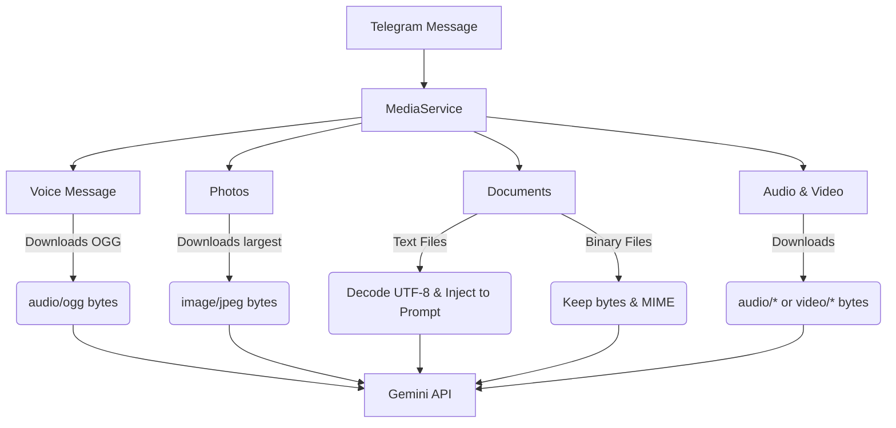

# MediaService Documentation

The `MediaService` is a dedicated, extensible service introduced to process different media formats received from Telegram messages and prepare them for the Gemini LLM.

## Architecture

`MediaService` abstracts the downloading and processing of media attachments out of the primary Telegram routers. This keeps `handlers.py` lightweight and simplifies adding support for new media or files.



## How It Works

`MediaService.process_message_media(message, override_text=None)` inspects a Telegram message for the following fields:
1. **`voice`**: Extracts voice notes. Downloads the file and formats as an `audio/ogg` part.
2. **`photo`**: Extracts single photos (non-album). Downloads the highest resolution version and formats as `image/jpeg`.
3. **`document`**: Extracts document uploads.
   - If the file is classified as a text file (via extension or MIME type) and can be decoded as UTF-8, its contents are appended directly to the text prompt inside a code block (`[Attached File: filename.py]`).
   - Otherwise, the document is downloaded and passed as raw bytes along with its MIME type (e.g. `application/pdf`).
4. **`audio`**: Extracts audio file attachments (e.g., MP3 files). Downloads and formats as `audio/*`.
5. **`video` / `video_note`**: Extracts standard videos and round video messages. Downloads and formats as `video/mp4` or other appropriate video MIME types.

### Injected Prompts for Media

If the user sends media without a caption, the system dynamically appends a default instruction to prompt the LLM correctly:
* **Voice messages**: `Listen to the voice message and reply to it.`
* **Images**: `Describe the images.`
* **Files/Documents**: `Process the attached files.`

---

## Adding Support for a New Media Type

To add a new media type, follow these steps:

### 1. Update `process_message_media` in `bot/media_service.py`

Add a detection block for the new media property in `aiogram.types.Message`. For example, to add support for **stickers** or **locations**:

```python
        # Example: Support Stickers by sending sticker metadata or file
        elif message.sticker:
            sticker = message.sticker
            # Download or extract metadata
            file_info = await message.bot.get_file(sticker.file_id)
            file = await message.bot.download_file(file_info.file_path)
            sticker_bytes = file.read()
            media_parts.append({
                "data": sticker_bytes,
                "mime_type": "image/webp"  # Stickers are WEBP or TGS (gzip JSON)
            })
```

### 2. Update default prompts in `bot/handlers.py`

If the new media type requires a default textual prompt when a caption is missing, add it to the `_process_message` default prompt resolution block:

```python
            # In bot/handlers.py
            if has_sticker:
                prompt = "Analyze this sticker."
```
